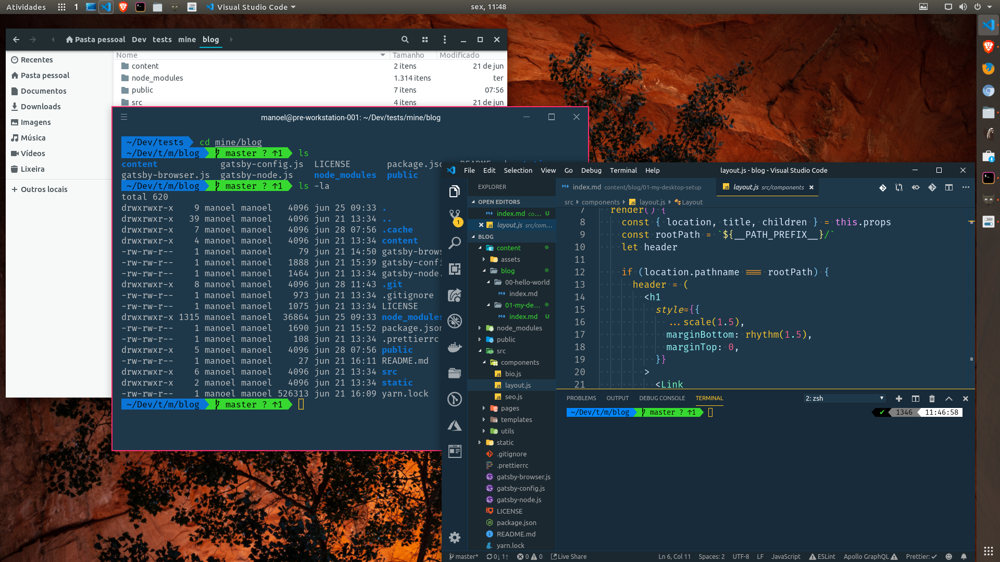
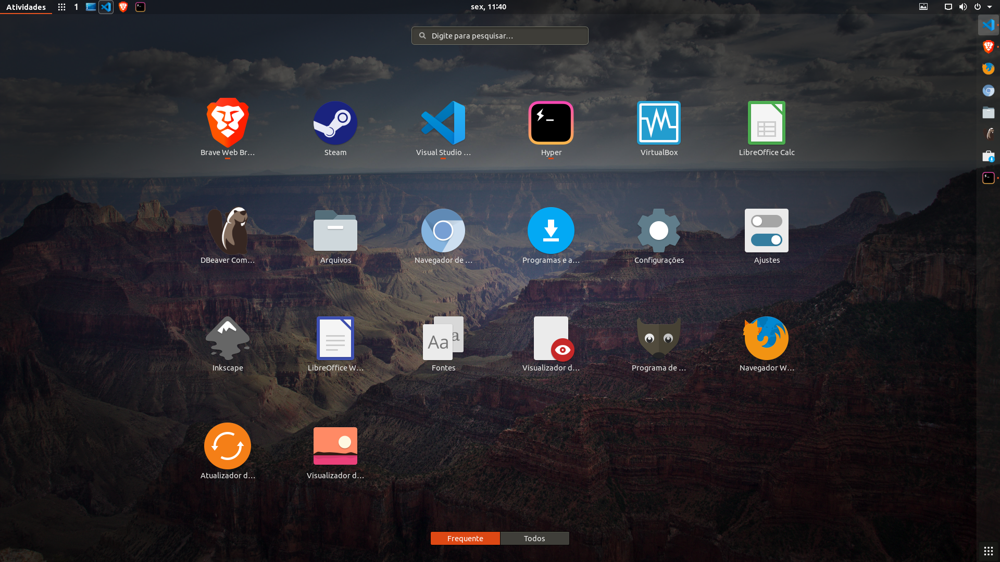

I spend a good amount of my time programming (8+ hours, Monday to Friday at least) with an Ubuntu Linux workstation since 2012. A few years ago, I started to tweak a setup that I thought it was nice to look and reduced eyestrain as much as possible. A previous look at my setup was registered in a [GitHub repository](https://github.com/ManoelLobo/my-desktop-setup), but I changed it since then, so here come the new looks!



<br />



<br />

The first step of this quest was to find an editor that I could use for a long time, without too much distraction, a light and fast one, but powerful enough that I hadn't to rely on many other tools to get the job done. IDEs (as [Eclipse](https://www.eclipse.org/downloads/) and [NetBeans](https://netbeans.org/)) were quite powerful but took a long time to initialize and had a lot of visual clutter. So, I passed to the 'lightweight' editors: [Sublime Text](https://www.sublimetext.com/), [Atom](https://atom.io/) and [Visual Studio Code](https://code.visualstudio.com/). Each of them had its strengths, but I settled for the VSCode for a few reasons: integrated terminal from the start, constant development, nice extension support, good and functional interface, and relative maturity took me to adopt it as my editor.

Besides the helper extensions, I looked for a theme that was nice to look for an entire day. Went through some nice Material-based themes and icons. But really liked Wes Bos' [Cobalt2 theme](https://marketplace.visualstudio.com/items?itemName=wesbos.theme-cobalt2) and, more recently, Sarah Drasner's [Night Owl](https://marketplace.visualstudio.com/items?itemName=sdras.night-owl).

I also adopted the zsh shell with a few gimmicks, namely the Oh My Zsh framework and the powerlevel9k theme; and also the Fura Code and Space Mono fonts, patched by Ryan Oasis' [Nerd Fonts](https://nerdfonts.com) to comply with the PowerShell-like terminal decoration.

Meanwhile, I tested a lot of variations for the Ubuntu desktop (Unity, Kubuntu, Lubuntu, Mate). In the end, I settled down using the default Gnome shell, plus [Adapta GTK theme](https://github.com/adapta-project/adapta-gtk-theme) and [Paper Icons](https://snwh.org/paper) by Sam Hewitt.

As it is a long list of things, I thought it would be better to split in a few posts, instead of creating a gigantic, tiresome list. This is mostly a reminder to myself of what steps I have to do in case I have to reconfigure my desktop. If you got interested and want to try some/all of my custom setup, be my guest!

For this first part, Ubuntu!

## Configuring the OS

I use the [Ubuntu](https://ubuntu.com/download/desktop) default distro, but make a few adjustments to my taste. For that, I use the Tweaks tool to choose theme and icons that will be installed next (`sudo apt install gnome-tweaks` if it is not already installed)

### Adapta GTK Theme

It is necessary to add the repository to the system sources list before installing it:

```sh
$ sudo add-apt-repository ppa:tista/adapta
$ sudo apt update
$ sudo apt install adapta-gtk-theme
```

### Paper Icons

Similarly, to add the Paper Project repo:

```sh
$ sudo add-apt-repository ppa:snwh/pulp
$ sudo apt update
$ sudo apt install paper-icon-theme
```

### Activating all

Open the Tweaks tool from the Applications list or from the terminal with the command `gnome-tweaks`. In the tab _Appearance_, choose _Adapta_ (or variants) from the GTK+ dropdown, and _Paper_ from the _Icons_ one. Done, you are themed (well, you still need to restart the session).

---

Hope this first part be useful for someone (for the future me, at least!). See you on the next post!
