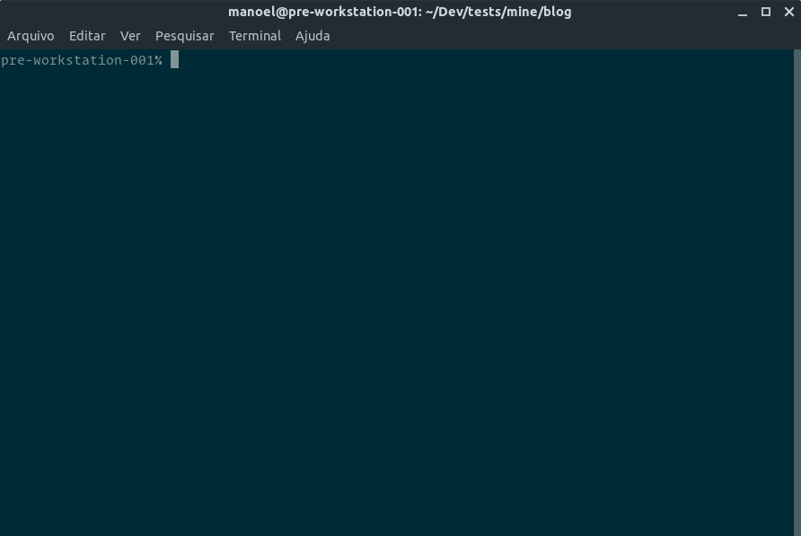
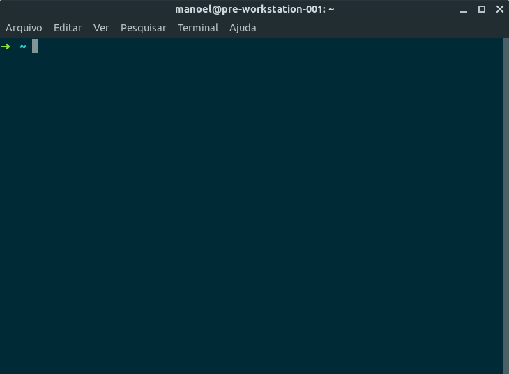
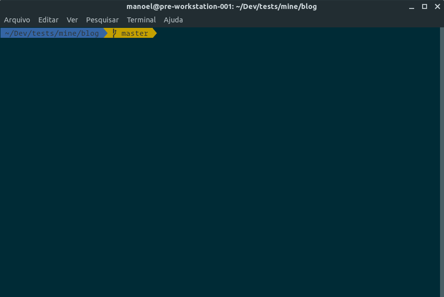
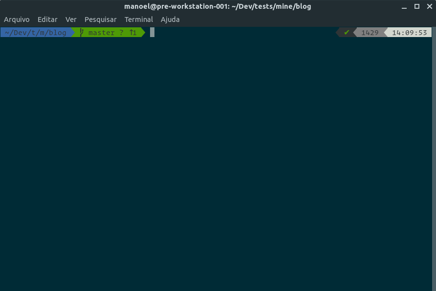
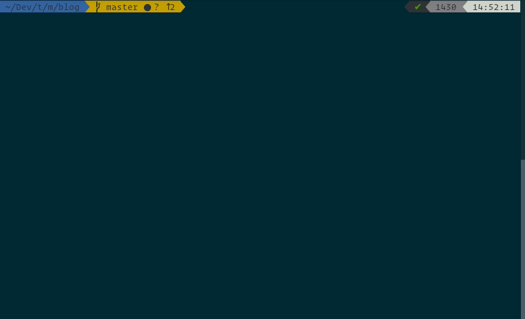

On my [last post](01-my-desktop-setup), I talked a bit about setting the OS appearance to my liking. Now, to the shell.

For a few years, I used [fish](https://fishshell.com) as my default shell. It was pretty user-friendly and easy to configure. But its syntax was not bash-compliant and I had to exercise my brain to put some workarounds to use tools that I needed to use frequently (and sometimes without having the same results).

I tested Zsh previously, but only recently put the effort to set it in a way that kept me pleased and productive. Here go the steps to put together what I tried.

## Installing Zsh

To use Zsh in Ubuntu, you need to install it and set as your default shell:

```bash
$ sudo apt install zsh
$ chsh -s $(which zsh)
```

After these steps are complete, restart the user session to validate the change.

The next time you open your terminal, you will be greeted with the configuration function for new users and may press <kbd>2</kbd> to accept the defaults for now. This shall show a slightly different prompt without much flair, but we will solve it next.



<br>

## The "Oh my!" effect

Customizing the terminal can be a quite daunting task. Luckily, there are great tools that allow us to ease it a bit. My choice is the [Oh My Zsh](https://ohmyz.sh) framework by Robbie Russell and contributors.

To install it:

```bash
$ sh -c "$(curl -fsSL https://raw.github.com/robbyrussell/oh-my-zsh/master/tools/install.sh)"
```

> You need `curl` and `git` installed, so `sudo apt install curl git` in case they are not already in place.



<br>

It is... different. We got the git status indicator, yay!. But not much attractive yet.

### Theme

The Oh My Zsh framework comes with a lot of themes, like one of my favourites, agnoster. To set one of these, you just need to edit the zshrc configuration file (`~/.zshrc`):

```bash
ZSH_THEME="agnoster"
```



<br>

Thou I find this theme quite eye-pleasing, I decided to use the `powerlevel9k` one and pump it up a little to my preferences. It works in tandem with powerline-fonts to the visual niceties.



<br>

First, to install it:

```bash
$ sudo apt install powerline powerline-fonts
$ git clone https://github.com/bhilburn/powerlevel9k.git ~/.oh-my-zsh/custom/themes/powerlevel9k
```

Then, edit the `~/.zshrc` file and add a few more lines to adjust the theme:

```bash
# Hide the user from the prompt
DEFAULT_USER=$USER

# Shorten the folder breadcrumbs
# ~/my/extremely/long/fumbled/path becomes ~/my/e/l/f/path
POWERLEVEL9K_SHORTEN_DIR_LENGTH=1
POWERLEVEL9K_SHORTEN_DELIMITER=""
POWERLEVEL9K_SHORTEN_STRATEGY="truncate_from_right"
```

### Shameless plug(ins)

I must admit that I am slightly lazy, so I'd prefer that my tools do the work for me. In the terminal case (no pun intended), I want that it complete my sentences, remember what I typed earlier, show me if I am typing something wrong, and so on. For my better fortune, there are two plugins for that: [zsh-autosuggestions](https://github.com/zsh-users/zsh-autosuggestions) and [zsh-syntax-highlighting](https://github.com/zsh-users/zsh-syntax-highlighting).

To install them, clone their git repos into the plugins folder of Oh My Zsh:

```bash
$ git clone https://github.com/zsh-users/zsh-autosuggestions ${ZSH_CUSTOM:-~/.oh-my-zsh/custom}/plugins/zsh-autosuggestions
$ git clone https://github.com/zsh-users/zsh-syntax-highlighting.git ${ZSH_CUSTOM:-~/.oh-my-zsh/custom}/plugins/zsh-syntax-highlighting
```

After that, edit your `~/.zshrc` (again!) and add those to the plugins section:

```bash
plugins=(
  zsh-autosuggestions
  zsh-syntax-highlighting
  # any other plugins come in here too
)
```

And look as it goes!



---

Wow! Quite a lot in this post. Time to take a break and see you next time!
