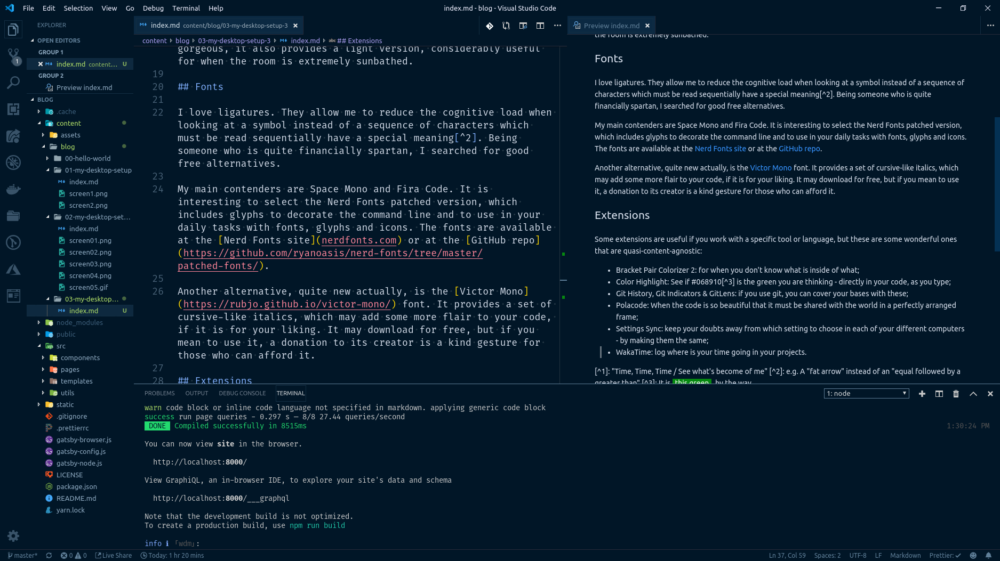
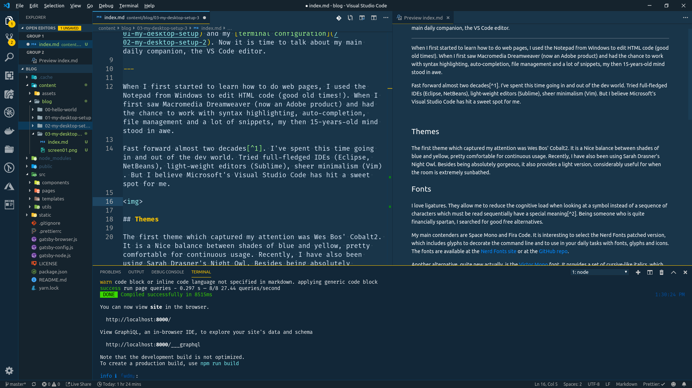

I already discussed at length about my [OS look](/01-my-desktop-setup) and my [terminal configuration](/02-my-desktop-setup-2). Now it is time to talk about my main daily companion, the VS Code editor.

---

When I first started to learn how to do web pages, I used the Notepad from Windows to edit HTML code (good old times!). When I first saw Macromedia Dreamweaver (now an Adobe product) and had the chance to work with syntax highlighting, auto-completion, file management and a lot of snippets, my then 15-years-old mind stood in awe.

Fast forward almost two decades[^1]. I've spent this time going in and out of the dev world. Tried full-fledged IDEs (Eclipse, NetBeans), light-weight editors (Sublime), sheer minimalism (Vim). But I believe Microsoft's Visual Studio Code has hit a sweet spot for me.

## Themes

The first theme which captured my attention was Wes Bos' Cobalt2. It is a Nice balance between shades of blue and yellow, pretty comfortable for continuous usage. Recently, I have also been using Sarah Drasner's Night Owl. Besides being absolutely gorgeous, it also provides a light version, considerably useful for when the room is extremely sunbathed.

## Fonts

I love ligatures. They allow me to reduce the cognitive load when looking at a symbol instead of a sequence of characters which must be read sequentially have a special meaning[^2]. Being someone who is quite financially spartan, I searched for good free alternatives.

My main contenders are Space Mono and Fira Code. It is interesting to select the Nerd Fonts patched version, which includes glyphs to decorate the command line and to use in your daily tasks with fonts, glyphs and icons. The fonts are available at the [Nerd Fonts site](nerdfonts.com) or at the [GitHub repo](https://github.com/ryanoasis/nerd-fonts/tree/master/patched-fonts/).

Another alternative, quite new actually, is the [Victor Mono](https://rubjo.github.io/victor-mono/) font. It provides a set of cursive-like italics, which may add some more flair to your code, if it is for your liking. It may download for free, but if you mean to use it, a donation to its creator is a kind gesture for those who can afford it.

## Extensions

Some extensions are useful if you work with a specific tool or language, but these are some wonderful ones that are quasi-content-agnostic:

- [Bracket Pair Colorizer 2](https://marketplace.visualstudio.com/items?itemName=CoenraadS.bracket-pair-colorizer-2): for when you don't know what is inside of what;
- [Color Highlight](https://marketplace.visualstudio.com/items?itemName=naumovs.color-highlight): See if #068910[^3] is the green you are thinking - directly in your code, as you type;
- [Git History](https://marketplace.visualstudio.com/items?itemName=donjayamanne.githistory), [Git Indicators](https://marketplace.visualstudio.com/items?itemName=lamartire.git-indicators) & [GitLens](https://marketplace.visualstudio.com/items?itemName=eamodio.gitlens): if you use git, you can cover your bases with these;
- [Polacode](https://marketplace.visualstudio.com/items?itemName=pnp.polacode): When the code is so beautiful that it must be shared with the world in a perfectly arranged frame;
- [Settings Sync](https://marketplace.visualstudio.com/items?itemName=Shan.code-settings-sync): keep your doubts away from which setting to choose in each of your different computers - by making them the same;
- [WakaTime](https://marketplace.visualstudio.com/items?itemName=WakaTime.vscode-wakatime): log where is your time going in your projects.

---

And that's all folks! Thanks for reading!

[^1]: "Time, Time, Time / See what's become of me"
[^2]: e.g. A "fat arrow" instead of an "equal followed by a greater than"
[^3]: It is this green, by the way
